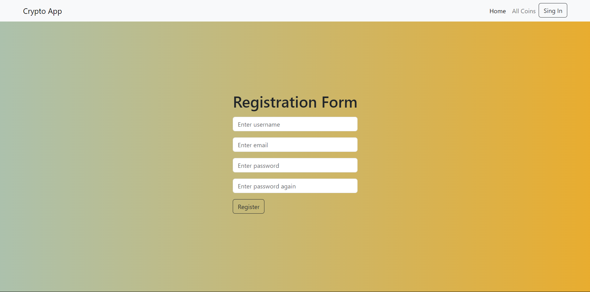
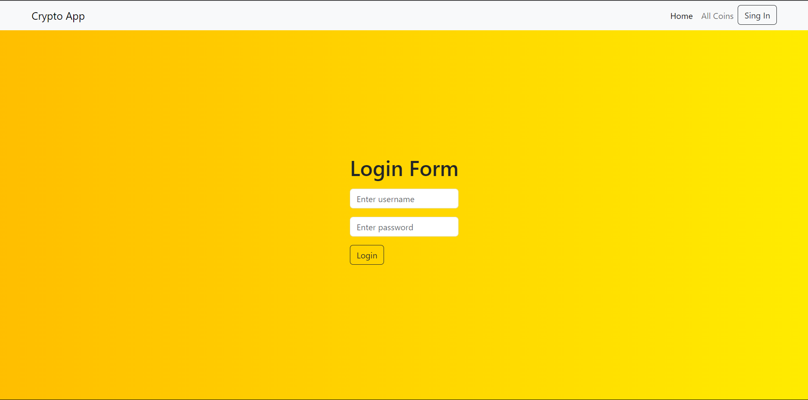
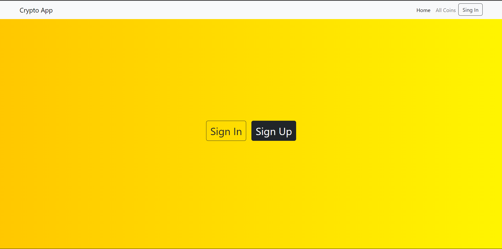
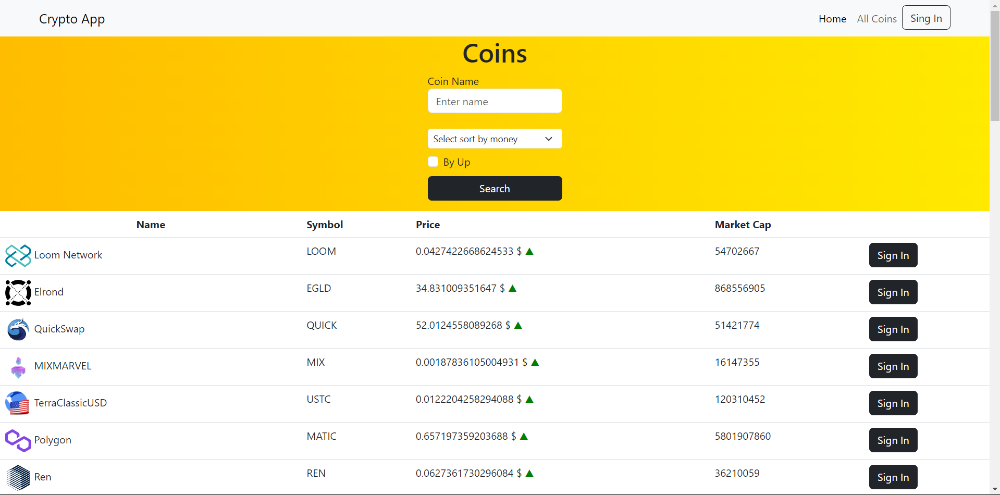
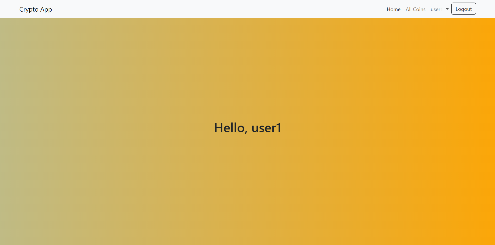
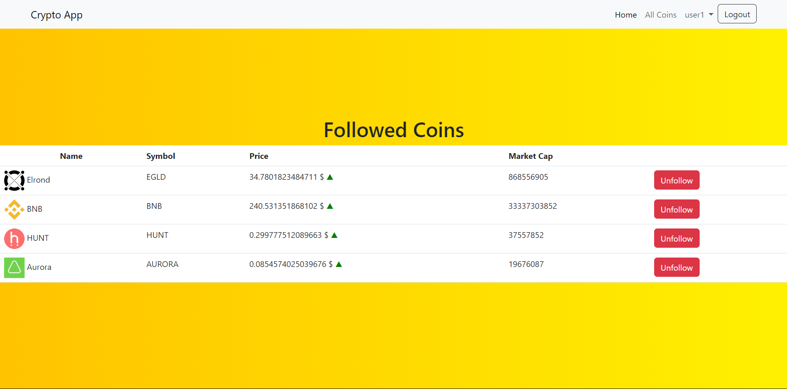
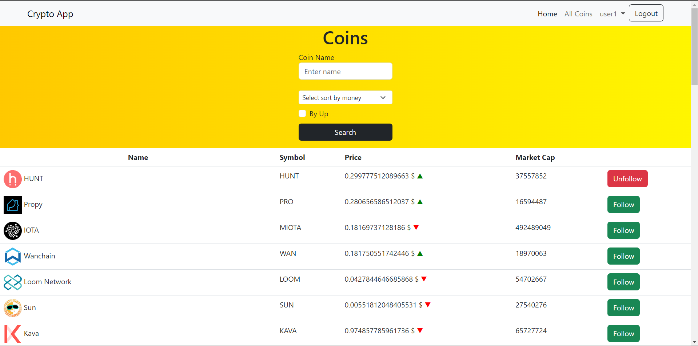

<h1>C# ASP.NET Razor Pages Crypto App</h1>

<h2>After run project</h2>

## On https://localhost:3001 you can see result
Registration and Log in pages:

# Another pages before authentication:

# Another pages after authentication:

